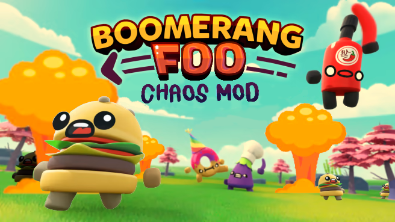

Boomerang Foo: Chaos Mod
======================================

Boomerang Foo: Chaos Mod (BFoo for short) is a mod for the 2020 couch PvP party game *Boomerang Fu* by Cranky Watermelon. BFoo provides custom settings, powerup modifiers, and gamemodes. It is built with the [BepInEx](https://github.com/BepInEx/BepInEx/) runtime patching framework. The mod was originally created by @ws13sk and adapted to BepInEx by @Jeffjewett27. 

## Installation

1. Download `BoomerangFoo-<version>.zip` in the releases.
2. Unzip the files into `C:\Program Files (x86)\Steam\steamapps\common\Boomerang Fu`. The BepInEx folder should be in the same folder as `Boomerang Fu.exe`.
3. Open the game to initialize the files and configs.

*Note: to update, you only need to replace the `BoomerangFoo.dll` file in `Bepinex/plugins/BoomerangFoo` with the `BoomerangFoo.dll` in the releases.*

## Disabling Mod

The simplest way to disable the mod is to remove `Bepinex/plugins/BoomerangFoo/BoomerangFoo.dll`. Copy it to a different location and restore it when you want to enable the mod again.

## Features

1. New gamemodes!
- Power Drain: Kill other players to get powerups and remove their powers.
- Juggernaut: It's a 1 versus all battle, where the juggernaut has awesome powers. Take them down to become the new juggernaut.
- Survive 'Till Dawn: There is one player with weapons and the rest must run away.
- Team Golden: Join teams for Golden Boomerang. Your team must collectively hold onto the boomerang to score.
2. Custom game settings
- Match length: Set any number of points to win.
- Rapid powerup spawns: The powerup spawn rate can be boosted.
- Max powerups: Change the maximum number of powerups a player can hold.
- Starting powerups: Give each of the players powerups at the beginning of the match.
- Bouncy boomerangs: Multiply or dampen the bounciness of boomerangs off walls. Be careful in enclosed spaces...
- Boomerang size: Change the size of boomerangs.
3. Powerup modifiers (described below)
3. Impossible bot difficulty: unlock the secret difficulty level buried in the game's code.
4. UI changes: change gamemodes and settings in-game.

## Powerup Modifiers

- Bamboozled
  - Duration: How long you stay bamboozled for. This might be broken
  - Invulnerable: Whether you gain invincibility while bamboozled (haven't tested)
- Decoy
  - Maximum Decoys: How many decoys can be on screen at once.
- Explosive
  - Radius Factor: How much to scale the explosion radius by.
- Fire
  - Burning Survival: Change how long a player with Fire power survives while burning.
- Hover
  - Hover Duration: Change how long you can hover over hazards for.
  - Timer Refresh: Switch between refreshing upon touching ground or resetting each round.
  - Hover Powerup: Select which powerup(s) the hover modifier is added to.
- Caffeinated
  - Speed Factor: How fast you are when caffeinated.
  - Attack Speed: How fast do you melee when caffeinated.
- Shield
  -  Shield Hits: Number of hits a shield can withstand

## Disclaimer
This mod is unaffiliated with Cranky Watermelon and contains no *Boomerang Fu* assets.

## License
Distributed under the MIT [license](https://github.com/Jeffjewett27/BoomerangFoo/blob/master/LICENSE.txt).
